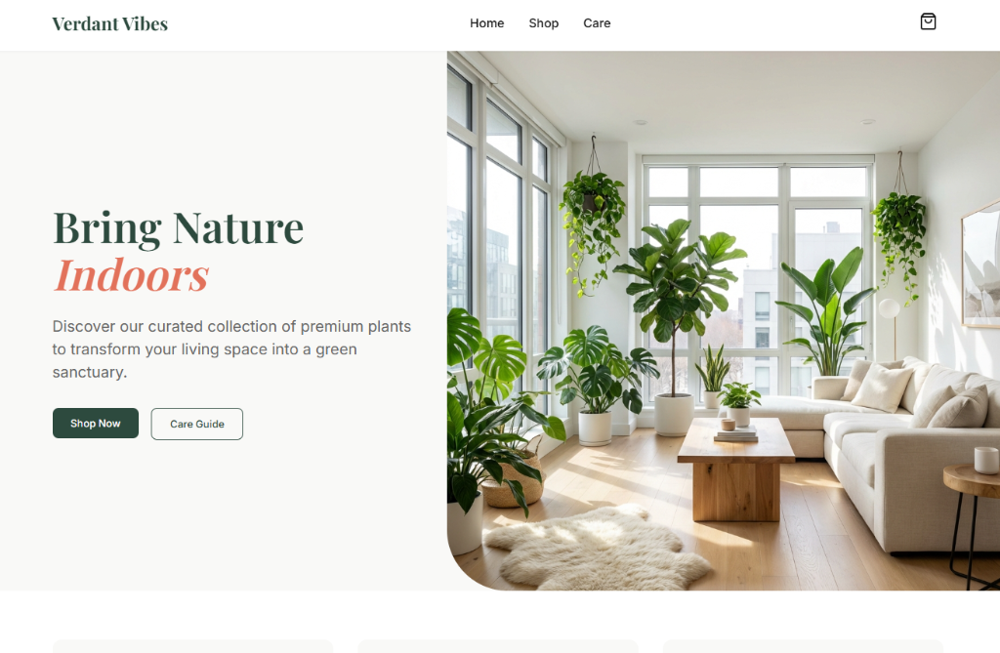
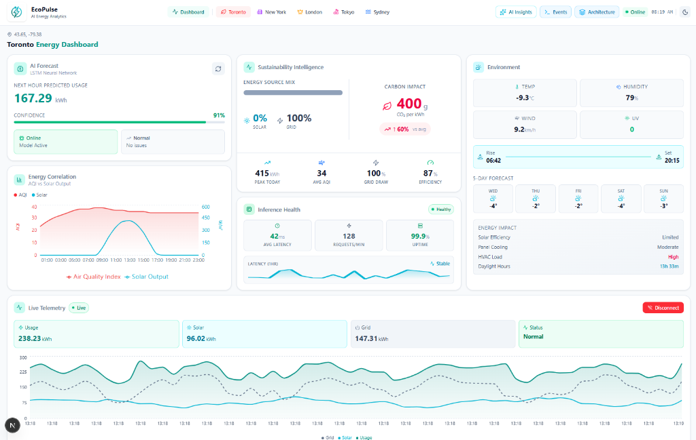

# Hi, I'm Salman.
### Senior Full-Stack Engineer
#### Specializing in Scalable Web Architecture & Performance Optimization

---

### 🚀 About Me

I am a results-driven engineer focused on building robust, accessible, and high-performance web applications. I bridge the gap between complex backend logic and intuitive frontend design. My expertise lies in the JavaScript ecosystem, cloud infrastructure, and delivering production-ready code that drives business value.

Currently, I am focused on:
*   **Architecting** scalable single-page applications (SPAs).
*   **Optimizing** frontend performance and Core Web Vitals.
*   **Developing** secure RESTful APIs and microservices.

---

### 🛠 Featured Projects

| **Growhause Plants** | **EcoPulse Dashboard** |
| :--- | :--- |
|  |  |
| **E-Commerce Architecture** | **Data Visualization & Analytics** |
| A modern e-commerce solution featuring a custom shopping cart implementation, complex state management, and optimized asset delivery for high-traffic scalability. | A comprehensive environmental dashboard aggregating real-time data. Features interactive charting, dark mode implementation, and responsive grid layouts for data reporting. |
| 🔗 [**Live Demo**](https://growhaus-plants.netlify.app/) | 🔗 [**Live Demo**](https://ecopulse-dashboard.netlify.app/) |

---

### 💻 Technical Expertise

Instead of just using tools, I select the right stack for the job. Here is my preferred heavy artillery:
  
<b>Let's build something scalable together.</b>

