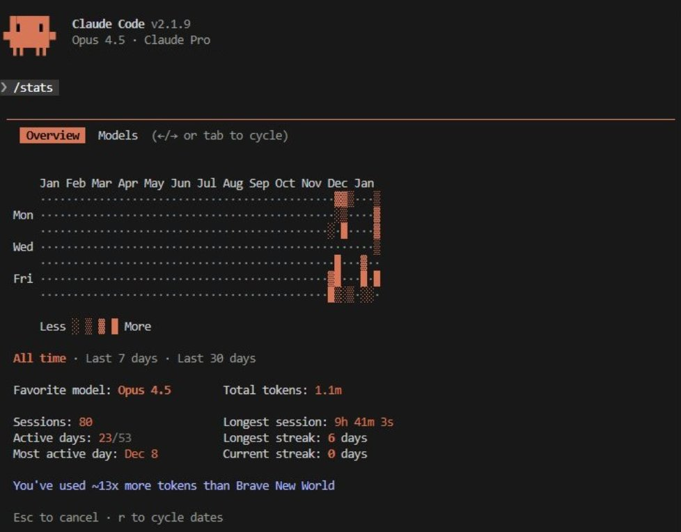

<h1>Hi, I'm Salman </h1>

<h3>Full-Stack Engineer</h3>

<strong>Building scalable web applications with modern JavaScript, cloud infrastructure, and pixel-perfect UIs.</strong>

<code>Turning complex problems into elegant, production-ready solutions.</code>

 

## 🚀 About Me

I am a results-driven engineer focused on building robust, accessible, and high-performance web applications. I bridge the gap between complex backend logic and intuitive frontend design. My expertise lies in the JavaScript ecosystem, cloud infrastructure, and delivering production-ready code that drives business value.

Currently, I am focused on:

- **Architecting** scalable single-page applications (SPAs).
- **Optimizing** frontend performance and Core Web Vitals.
- **Developing** secure RESTful APIs and microservices.

 

## 🛠 Featured Projects

**EcoPulse Dashboard**  
<strong>AI Energy Analytics Platform</strong> 
A full-stack AI dashboard with LSTM neural network for energy forecasting. Features real-time WebSocket telemetry, multi-city tracking, and dynamic data visualization with dark/light themes.
🔗 [**Live Demo**](https://ecopulse-dashboard.netlify.app/) ・ 📂 [**Source**](https://github.com/Salvero/ecopulse-dashboard)
 

**Growhause Plants**  
<strong>E-Commerce Architecture</strong> | <strong>Appointment Scheduling Platform</strong>
🔗 [**Live Demo**](https://growhaus-plants.netlify.app/) ・ 📂 [**Source**](https://github.com/Salvero/growhaus-plants)

 

## 💻 Technical Expertise

Instead of just using tools, I select the right stack for the job. Here is my preferred heavy artillery:

| Domain | Technologies |
| :--- | :--- |
| <strong>Frontend Architecture</strong> | `JavaScript (ES6+)` `TypeScript` `React` `Next.js` `Redux Toolkit` |
| <strong>Backend & API</strong> | `Node.js` `Express` `Python` `REST Architecture` `GraphQL` `JSON` |
| <strong>Styling & UI</strong> | `Tailwind CSS` `SCSS` `Material UI` `ShadCN UI` `TweakCN` `Mobbin` `Framer Motion` |
| <strong>Tooling & Workflow</strong> | `Git` `GitHub` `Vercel/Netlify` `Cursor` `AI-Assisted Development` |

 

## 🤖 Claude Code Usage — AI-Augmented Development

Every project in my portfolio was architected and shipped using <strong>Claude Code</strong> as my primary AI pair-programming tool.

 

 

<samp>I don't just use AI — I leverage it as a force multiplier to ship production-grade code faster, debug smarter, and architect scalable systems from day one.</samp>

 

---

<h4>Open to discussions regarding Full-Stack & Frontend Engineering roles.</h4>

<strong>Let's build something scalable together.</strong>

 

